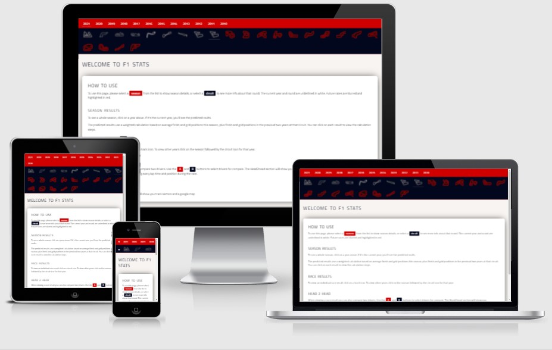
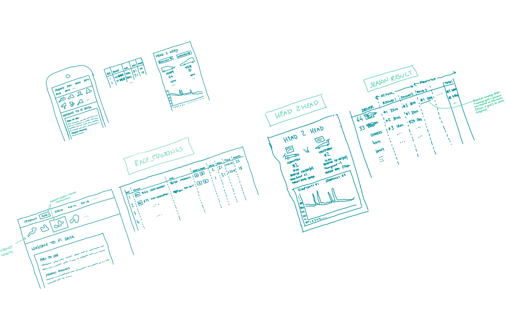
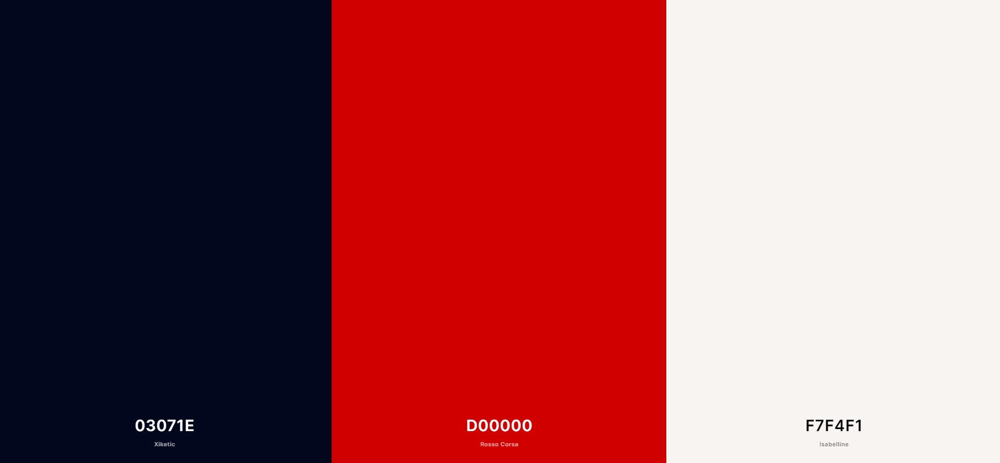

Lightroom original performance 81% - new 87%. accessibility 87% - new 100% (img alt tags)
Research

* TODO
* JS validator

# **F1 Stats**
## By Tom Naylor

**View live site:** https://tomnaylor.github.io/codeinstitute-ms2/

**View GitHub repo:** https://github.com/tomnaylor/codeinstitute-ms2

Welcome to my F1 statistics web app. The app is made up of a number of sections. A season summary, which includes a prediction of the final results for the remaining races; a race standings table for each race, a comparison tool between two drivers and information and google maps for each circuit.

I wanted to create a useful, accurate and interactive statistics website that shows available data in multiple ways to make useful comparisons, predictions and quickly referenced tabled data. The page should work across mobile, tablet and desktop but take a mobile-first approach.

## Table of contents
* [UX](#ux)
    * [User Stories](#user-stories)
    * [Site Owners Goals](#site-owners-goals)
    * [Design](#design)
        * [Original sketch](#original-sketch)
        * [Wireframes](#wireframes)
        * [Fonts](#font-family)
        * [Icons](#icons)
        * [Colours](#colours)
        * [Hero image](#hero-image)
* [Features](#features)
    * [Existing Features](#existing-features)
        * [Navigation](#navigation)
        * [Hero Image](#hero-image)
        * [Sign up buttons](#sign-up-buttons)
        * [Sign up modal](#sign-up-modal)
        * [Features Section](#features-section)
        * [Success stories](#success-stories)
        * [Pricing](#pricing)
        * [Guides](#guides)
        * [Contact Us](#contact-us)
        * [Footer](#footer)
        * [Features left to implement](#features-left-to-implement)
* [Technologies used](#technologies-used)
    * [Languages](#languages)
    * [Libraries](#libraries)
    * [Tools](#tools)
* [Testing](#testing)
    * [Manual Testing](#manual-testing)
        * [Navigation menu](#navigation-menu)
        * [Current user testimonials](#current-user-testimonials)
        * [Sign up and contact forms](#sign-up-and-contact-forms)
    * [Discovered Bugs](#discovered-bugs)
* [Deployment](#deployment)
    * [Running a local copy](#running-a-local-copy)
* [Credits](#credits)
    * [Content](#content)
    * [Media](#media)
    * [Acknowledgements](#acknowledgements)

## UX

### Target Audience
* Formula one fans
* statistics consumers
* Betting fans

### User Stories
#### First time visitor
As a first time user:
* I want to be guided to the most current race
* I want the features explained with clear and concise languages
* I want to see current points haul for each driver as the season progresses
* I want to see a prediction for final positions after all rounds are complete

#### Returning visitor
As a returning visitor:
* I want to see new data as soon as possible
* I want to see updated predictions for the current season
* I want to know what races are left this season and where / when they are
* I want the website to load quickly and only what I want to see

### Site Owners Goals
* Provide a useful way to view F1 data
* I want to make the website interactive
* I want to make the website easy to navigate
* I want the website to evolve as the season progresses
* I want the prediction for season result to be as accurate as possible
* Include images to make it easier to view the dataset
* Include interactive charts to view side-by-side racing data comparisons

### Design

#### Wireframes
I used a drawing tool to create a wireframe for the two responsive sizes (desktop and mobile). You can [view the wireframe here](assets/readme/readme-wireframe.jpg)

#### Font family
To provide a reliable and fast font library, I have used [Google Fonts](https://fonts.google.com/ "Google Fonts"), picking a font that worked with the racing theme and was easy to read when faced with lots of table data. For all text I chose the [Titillium Web](https://fonts.google.com/specimen/Titillium+Web?preview.text=FormulaOne&preview.text_type=custom "Google fonts: Raleway") font.

#### Icons
To add a more familiar feel to the website, I have added icons to sit alongside (and sometimes instead of) text links and buttons. I choose the [Font Awesome library](https://fontawesome.com/ "Font Awesome").

#### Colours
I used [Coolors](https://coolors.co) to find three colors that worked well together and helped define the racing theme. [The colour pallett is here](https://coolors.co/03071e-370617-6a040f-9d0208-d00000-dc2f02-e85d04-f48c06-faa307-ffba08)

## Features

### Existing Features

#### Navigation
I have tried to make a intuitive, accessible and reactive navigation bar that stays useful across different screen sizes and devices. For desktop the navigation has every season and track with a useful hover for all the circuits showing a flag, data, time and race name in a popup modal. On mobile the entire menu is shrunk into two lines and an arrow icon provides a button to expand the height and show the entire menu. Future races are highlighted in red with a no-access cursor icon. The current season and round is underlined to help quickly identify the most relevant race.

#### Help and how to use section
The initial section shows a handy how-to guide. This is replaced when any of the seasons or rounds are clicked.

#### Current season prediction
For the current season, the app will try and predict who will win each race, how the points will be assigned and where each driver will finish at the end of the season. Formula one currently gives points to the top 10 places. P1 gets 25, P2 18, P3 gets 16 all the way to P10, who gets the remaining point.

To calculate each race result the app uses 6 pieces of data and assigns a weight to each one. After the weighting is applied all the points are added together to provide a final score. The lowest 10 scores get the respective points.

Points (and their weighting):
* Average finish position this season (x1)
* Average qualifying position this season (x0.6)
* Finish position on this track last year (x0.3)
* Qualifying position on this track last year (x0.1)
* Finish position on this track two years ago (x0.3)
* Qualifying position on this track two years ago (x0.1)

#### Previous seasons
xxx

#### Race standings
xxx

#### Head to HEAD
xxx

#### Circuit info
xxx

### Features left to implement

#### Using cached
adding cache = https://blog.logrocket.com/javascript-cache-api/

#### More prediction inputs
look at previous years compared to finihed races this year to see if there's an average improvement compared to last year.

#### Prediction techniques
https://betterexplained.com/articles/how-to-analyze-data-using-the-average/
delete lowest result to help prediction

#### Fastest lap
add fastest lap point based on previous fastest laps

#### WIKI
Give users a gateway to more info

## Technologies used

### Languages
* [HTML5](https://en.wikipedia.org/wiki/HTML5) is used as the mark-up language in a single index.html file
* [CSS3](https://en.wikipedia.org/wiki/Cascading_Style_Sheets) as a single CSS file style.css is used for all screen sizes which also imports the font and icon Libraries
* [JavaScript](https://www.javascript.com/) is used for all the interactive elements of the app. It is made up of a few .js files
    * script.js is the main JS file which includes the initial calls and all custom functions.
    * date-format.js is an external function by Steven Levithan, which makes working with dates easier.
    * const.js holds objects created to add to the external API data that isn't provided by the source.
* [jQuery](https://jquery.com/) is used as the framework to make programming quicker. It's imported via a CDM and sits ontop of the native JavaScript language.

### Libraries + APIs
* [Google Fonts](https://fonts.google.com/) was used as the main font throughout the project.
* [Font Awesome](https://fontawesome.com/) was used to add icons for aesthetic and UX purposes.
* [Google maps](https://developers.google.com/maps) was used to add a map for the circuit
* [Ergast F1 data API](https://ergast.com/mrd/) was used as the main source of F1 data

### Tools
* [Git](https://git-scm.com/) and Git desktop was used for version control by utilizing the Gitpod program and ATOM intergration to commit to Git and Push to GitHub.
* [GitHub:](https://github.com/) is used to store the projects code after being pushed from Git.
* [GitPod](https://gitpod.io/) was used early in the project  
* [ATOM](https://atom.io/) was used as my IDE
* [Auto Prefixer](https://autoprefixer.github.io/) was used to add vendor specific CSS
* [JS HINT](https://jshint.com/) was used to validate the JavaScript files
* [W3C HTML](https://validator.w3.org/) and [Jigsaw](https://jigsaw.w3.org/css-validator/) validators were used to validate the HTML and CSS files
* [Google Lighthouse](https://developers.google.com/web/tools/lighthouse) was used to test page response, UX and further validation
* [Concepts](https://concepts.app/en/) was used to create the wireframe during the design process.
* [Coolors](https://coolors.co/) was used to find matching colours

## Testing

As well as the manual testing below I have also used the W3C HTML and CSS validator tools, Chrome Dev Tools and JS HINT. I found them very helpful to notify me of any potential problems and code that violates the standard. I also used the googles lighthouse to test the site load times and user experience.

### Automatic testers / validators

#### W3C HTML validator
The index.html page was tested using the w3c validator and passed without error. [view live result here](https://validator.w3.org/nu/?doc=https%3A%2F%2Ftomnaylor.github.io%2Fcodeinstitute-ms2%2F)

#### Jigsaw CSS Validator
The CSS was tested via direct input and no errors were found. [view live result here](https://jigsaw.w3.org/css-validator/validator?uri=https%3A%2F%2Ftomnaylor.github.io%2Fcodeinstitute-ms2%2Fassets%2Fcss%2Fstyle.css&profile=css3svg&usermedium=all&warning=1&vextwarning=&lang=en)

#### JS HINT
All 3 JavaScript files have been thru the JS hint app as direct input and show no errors.

### Testing against the user Stories
#### First time visitor
* I want to be guided to the most current race
  * The current season and race navigation is automatically loaded and the current season and round is underlined as to be quickly identifiable.
  * Once selected, the season or round has a clear contrasting background colour to show it's the current selection. The most recent season and race maintains the white underline.
* I want the features explained with clear and concise languages
  * As soon as the page loads a helpful guide is shown with clear headings and concise language.
  * Matching colours are used so you can quickly see what to expect
  * Different info is displayed across devices if there is a difference in the UI
* I want to see current points haul for each driver as the season progresses
  * in the season roundup you can click on each race for any driver and it will show the cumulative points haul
* I want to see a prediction for final positions after all rounds are complete
  * Clicking on the current season will load all the previous races and then predict each and every race of the season.
  * The season result will then add up the points and rank the drivers. The top three are then highlighted to further highlight them.

#### Returning visitor
* I want to see new data as soon as possible
* I want to see updated predictions for the current season
* I want to know what races are left this season and where / when they are
* I want the website to load quickly and only what I want to see

### Manual Testing
I have preformed manual tests on a number of browsers and devices to cover most scenarios and feel assured the website works as intended for all visitors. This included using google dev tools to simulate different screen sizes and using a real android and apple phone.

Results can be seen here:xxxxxxxxxxxxxxxxxxxxxxxxxxxxxxxxxxxxxxxxxxxxxxxx___________________

### Discovered Bugs
Bugs
Round number is highlighted in different years
lap timings - splitting up the numbers - see research
google chart not scaling with page size - see Research
charts array is pain!
flags could only find api for 2 digit code so had to store nationality in an array
head to head original was for i=1;i<=2;i++ loop - silly.
h2h - ++ was the wrong side of key
driver current standings rank = how...
driver current points rank sort without copying array: https://stackoverflow.com/questions/9592740/how-can-you-sort-an-array-without-mutating-the-original-array
array map for objects : https://stackoverflow.com/questions/14810506/map-function-for-objects-instead-of-arrays
number rounding to 2 places: https://stackoverflow.com/questions/11832914/how-to-round-to-at-most-2-decimal-places-if-necessary
too ages to work out the weighting - trial and error
when a driver didn't take part in a race the push() to add a td put it a race behind the table header. When doing the header, drew boxes for each race with an ID number
https://stackoverflow.com/questions/14810506/map-function-for-objects-instead-of-arrays
https://stackoverflow.com/questions/11832914/how-to-round-to-at-most-2-decimal-places-if-necessary
https://blog.stevenlevithan.com/archives/date-time-format

driver head to head // old way was to have a for loop and i be either 1 or 2 to match the input one or two - new way to create an array and loop thru
problem updating chart js (https://www.chartjs.org/docs/latest/developers/api.html / https://stackoverflow.com/questions/40056555/destroy-chart-js-bar-graph-to-redraw-other-graph-in-same-canvas)
season results fails when a track isn't in the circuits object (flag lookup)
year 2920 season results - final positions are 0.5 numbers and #1 is -0.5; - its when there are more than 20 drivers....

stop making future races in nav menu clikable: https://stackoverflow.com/questions/18712899/check-whether-the-date-entered-by-the-user-is-current-date-or-the-future-date

#### Resolved
* **Sign up button**
  * Sign-up button would move below hero image and disappear behind the main section in mobile devices.
  * To fix the issue I changed the position to use bottom and not top to ensure that whatever the height of the hero image, the CTA stayed 100px from the bottom.

#### Un-Resolved
xxxx

## Deployment
The final website has been deployed to GitHub via their pages option. Written in ATOM, after each commit and push, the master branch on GitHub was updated with the local commit. To work with the code on GitHub, I followed the steps below:

* Log into GitHub
* Create the repository
* Clone the GitHub repo into Atom identify
* Fetch and pull latest data before each session
* Git commit at an appropriate stage and add a useful comment
* Git push to sync with GitHub

In order to deploy the site I needed to setup GitHub pages; To do this I did the following:

* Log into GitHub
* Go to the repository
* Click "settings" and navigate to the "pages" section
* Select the master branch in the source dropdown
* Click "save"
* GitHub will provide a URL to the published site.

The URL for the GitHub page is https://tomnaylor.github.io/codeinstitute-ms2/

### Forking the app
To work on the code without changing the master branch, you can fork the repo to use in your chosen IDE. You simply need to log into GitHub, navigate to the repo, use the "fork" button in the top right and it will be added (as a copy) to your GitHub repos.

### Running a local copy
If you would like to run a local copy of this website, you would simply need to clone the master git repo. Follow the steps in deployment to clone the repo. There are no servers to configure, the website uses only HTML, CSS and JavaScript. You will need internet access to get the CDN files and the live API data.

## Credits

### Content

* JavaScript help with looping thru elements from [stackoverflow](https://stackoverflow.com/questions/50793136/javascript-click-function-only-works-on-first-element)
..............................................................
.......................................................................
........................................................................
.........................................................................
..........................................................................
.........................................................................
.........................................................................
.............................................................................................

### Media

* Circuit and car images were taken from [formula1.com](https://www.formula1.com/)
* Flags from [Country Flags](https://www.countryflags.io)

### Acknowledgements

The inspiration behind this website was based on watching the live prediction data during F1 races. I wanted to create an app that used know data to try and determine the outcome of a race.

I'd like to thank my mentor [Caleb Mbakwe](https://github.com/caleboau2012), who really helped define the project goals and helped put myself in both the user and the owners shoes. After each session I would have a list of topics to look at or suggestions for changes.

I would also like to thank the Slack community and CyC group for helping the course feel less "remote" and my partner that has needed to do ever more work around me.
